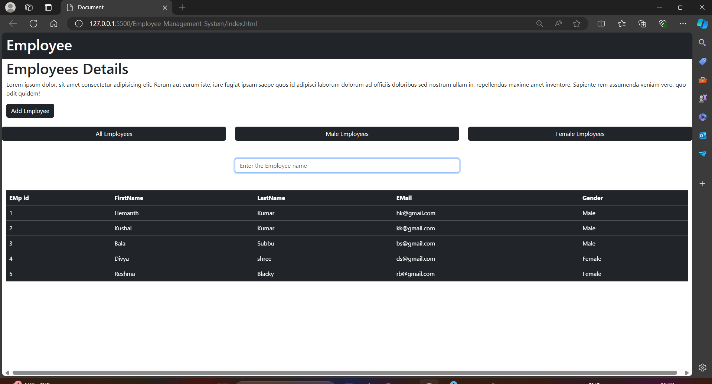

 Employee-Management-System

## Overview

The Employee Management System is a web-based application designed to facilitate the management and display of employee details. It offers functionalities for adding new employees, filtering by gender, and searching for specific employees by name.

## Key Features

- **Employee Data Display:** Displays a table listing employees with details such as ID, first name, last name, email, and gender.
- **Filtering Options:** Allows filtering employees by gender (Male or Female) with dedicated buttons.
- **Search Functionality:** Enables users to search for employees by name with real-time updates.
- **Responsive Design:** Utilizes Bootstrap for a responsive and modern UI design, ensuring compatibility across devices.

## Implementation Details

- **HTML Structure:** Uses HTML5 with Bootstrap CSS for styling components.
- **JavaScript (script.js):**
  - Defines employee objects and stores them in an array (`employess`).
  - Implements functions for displaying employees (`displayele`), filtering employees by gender, and searching employees (`Searched` function).
- **Event Handling:** Uses event listeners to trigger functions based on user interactions.

## images

- -

## How to Use
1. Clone the repository:
   git clone https://github.com/preshu2103/EMPLOYE-MANAGEMENT/tree/main

2. Open `index.html` in your web browser to view the application.
3. Interact with the buttons (`All Employees`, `Male Employees`, `Female Employees`) to filter employee views.
4. Use the search box to find specific employees by name.

## Future Enhancements

- **User Authentication:** Implement user login functionality to secure employee data access.
- **Database Integration:** Integrate with a backend database for data persistence.
- **Additional Features:** Add editing, deletion, sorting options, and detailed employee profiles.

## Contributors

- [@preshu2103-B PRASHANTH](https://github.com/preshu2103)

## Acknowledgements

- Built with [Bootstrap](https://getbootstrap.com/)
